# How to integrate Gitlab with Slack

## Merge request 발생 시 Slack Notification 처리 방법

### Slack 설정

Notification을 받기 위한 channel을 생성한다.

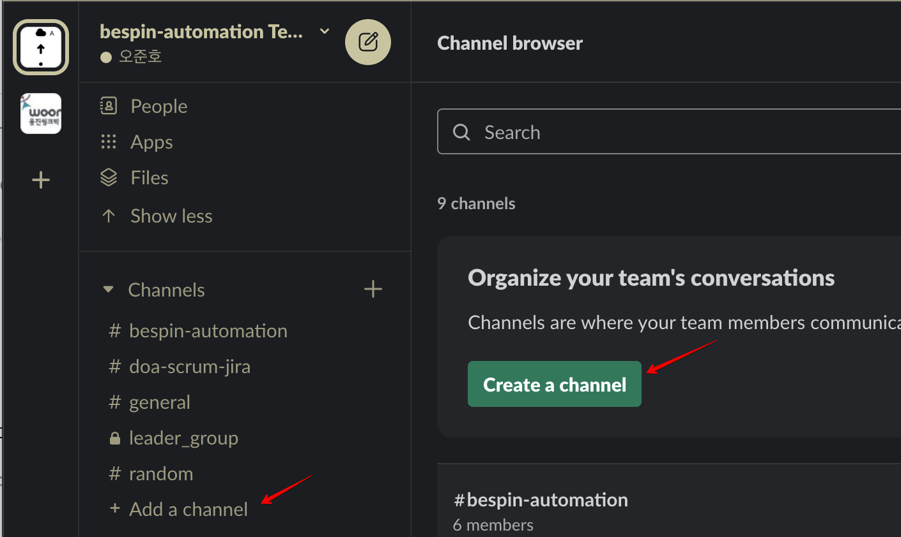

채널명을 입력한다.

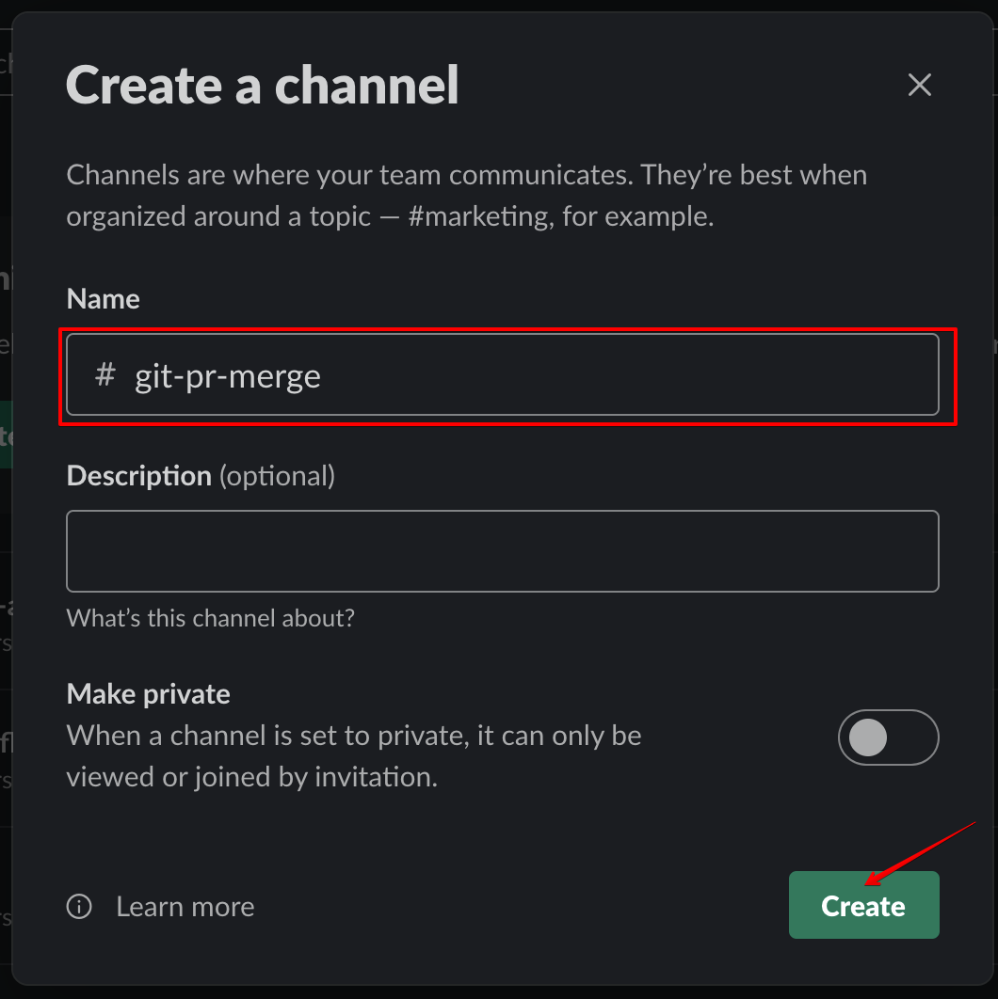

Notification을 받을 구성원 추가한다.

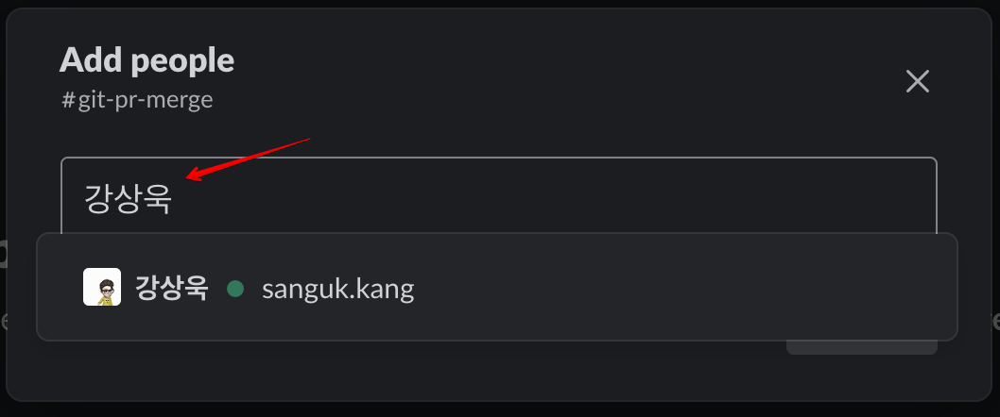

채널 생성 결과 화면

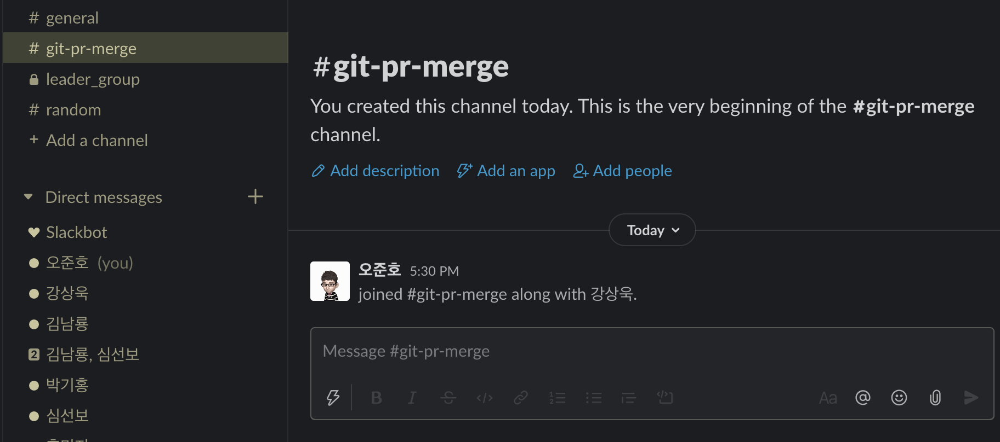

Add an App 또는 slack 우측 페이지의 Details에서 More > Add apps를 클릭한다.

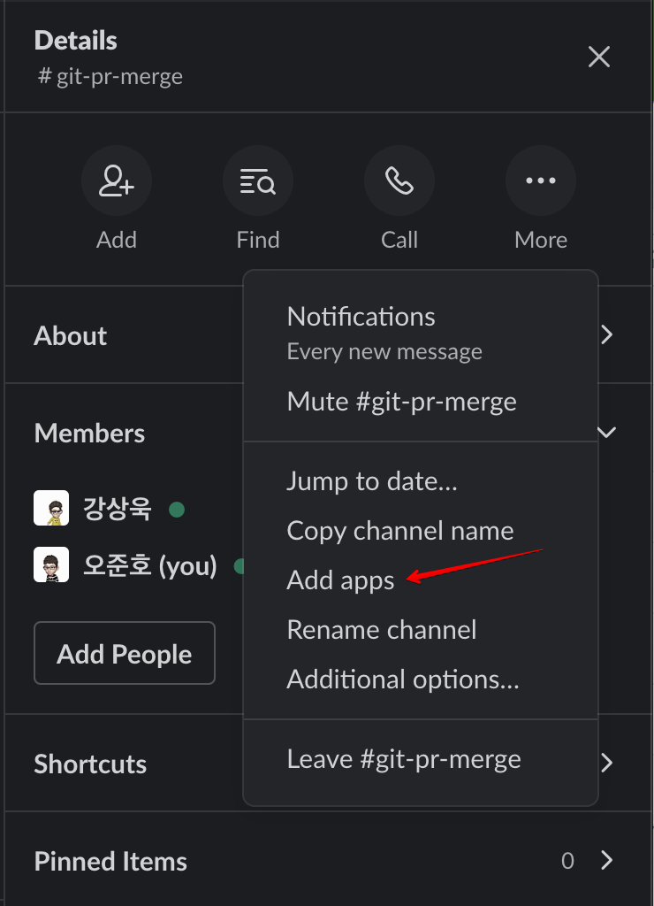

Incoming WebHooks 앱을 설치한다.

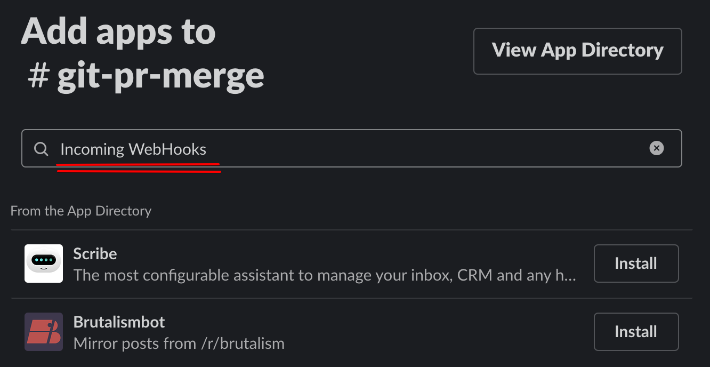

### 브라우저에서 slack 설정

팝업이 나타나면...

Add to slack을 클릭한다.

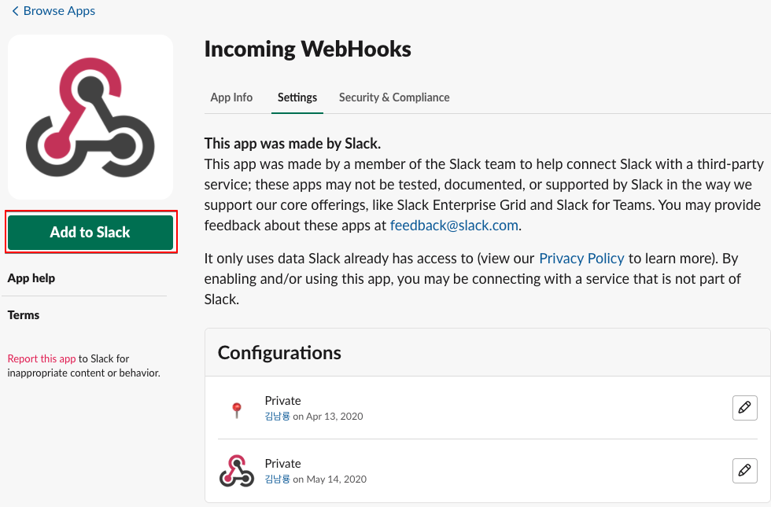

받을 채널 정보를 입력하고 하단 버튼을 클릭한다.

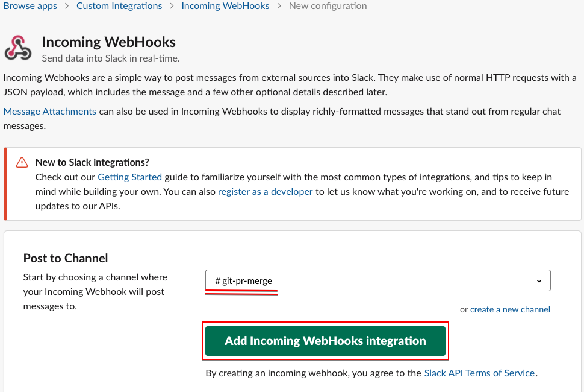

Webhook URL이 생성된 결과 화면이 나타난다.

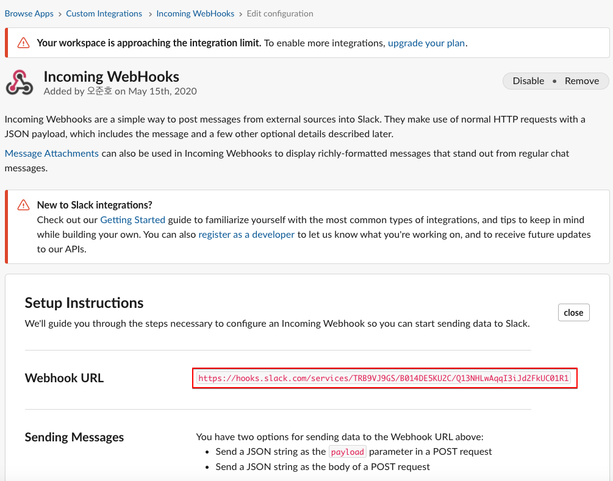

위 화면 아래 쪽을 보면 Copy를 진행할 수 있도록 정리되어 있다.

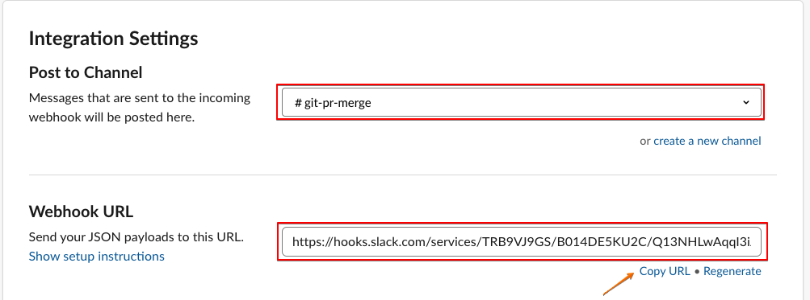

### Gitlab 설정

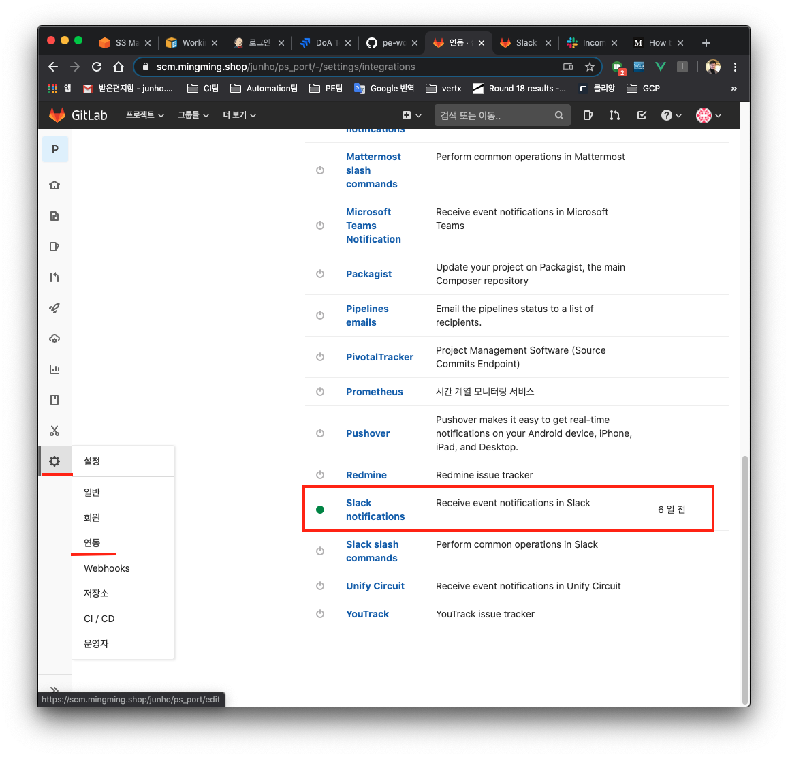

Active를 체크하고 **Merge request** 를 체크한다.(필요 시 다중 체크 가능)

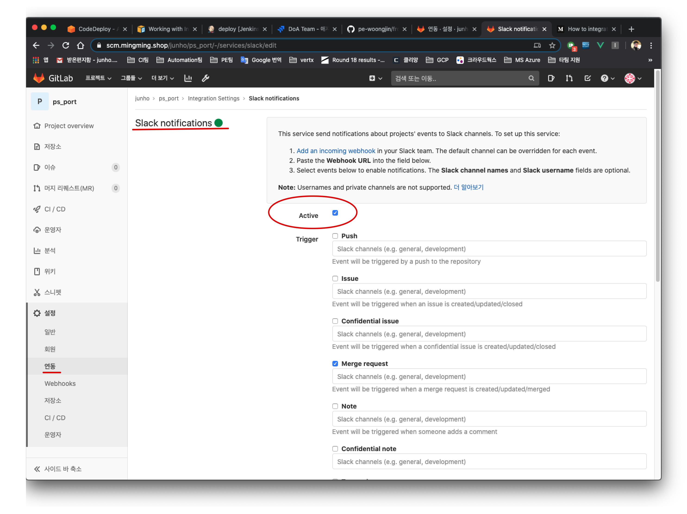

아래로 이동하여 Webhook 항목에 slack에서 만들어진 "Webhook URL"을 입력하고 하단 버튼을 클릭하여 설정을 마친다.

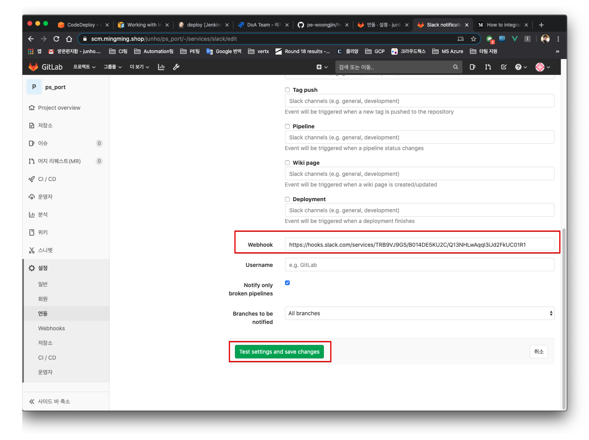
