# How to integrate Jenkins with Slack

## 1. Slack 설정
### 1-1) Jenkins APP 추가
- Apps > JenkinsCI > Add 클릭
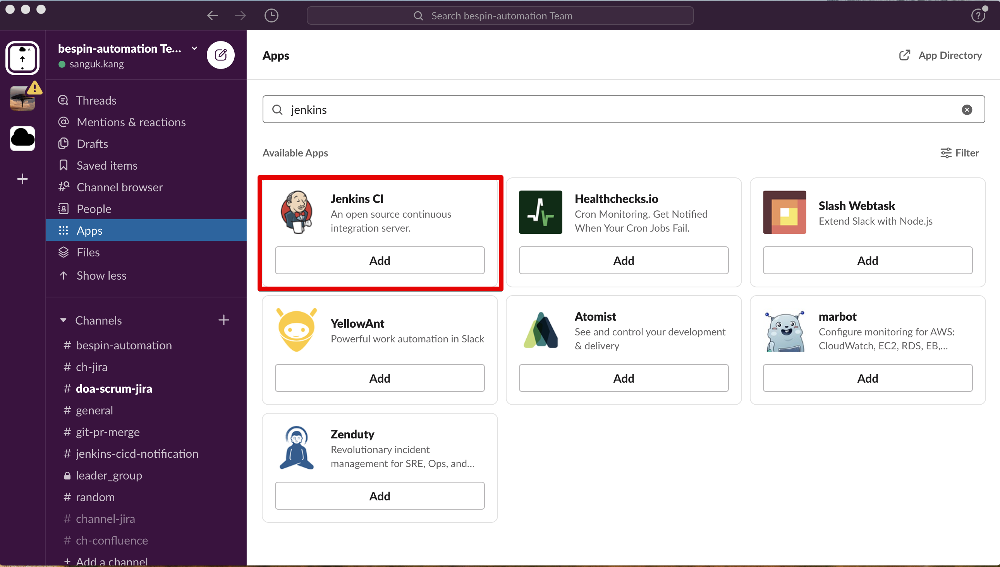

- Add to Slack 버튼 클릭
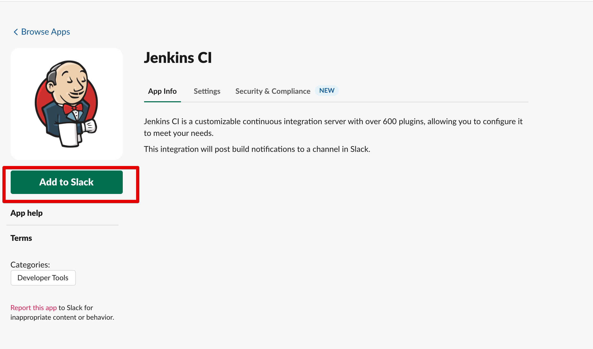

- slack 연동 채널 입력 후 Add 버튼 클릭
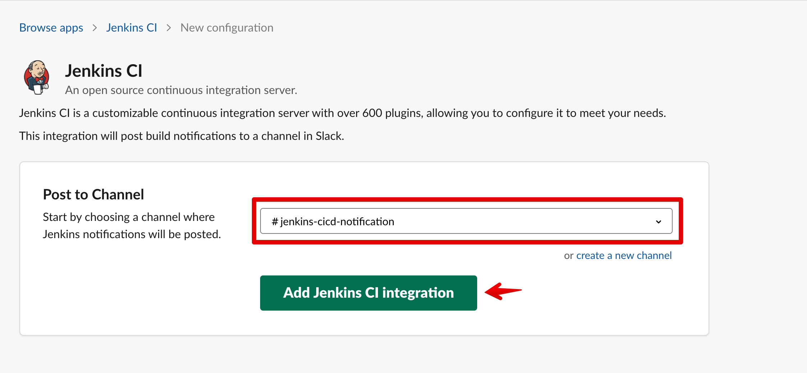

- 생성 완료
> 설치 과정이 마무리되면 Slack과 Jenkins의 연동 가이드가 나오며, 가이드 절차에 따라 설정해주면 됩니다. 
> 특히, Step 3의 Base URL과 Integration Token은 Jenkins 설정에 필요한 값으로 따로 기록해 두는 것이 좋습니다. 
> 단, 연동 가이드의 jenkins plugin 버전이 다른 경우 Jenkins 설정은 해당 가이드 문서를 따라 진행해주세요.
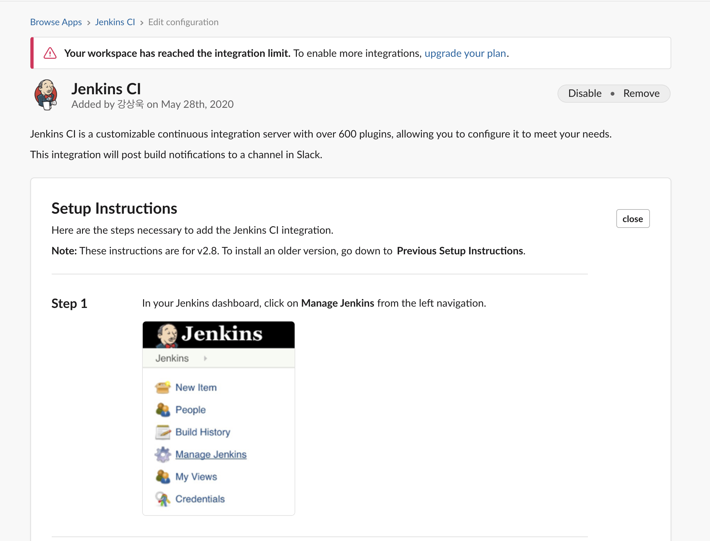

## 2. Jenkins 설정
### 2-1) Jenkins plugin 추가
- Slack Notification 검색 후 설치
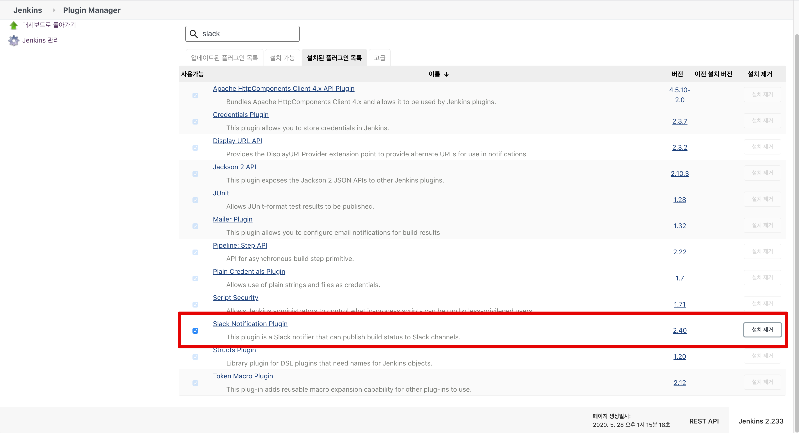

### 2-2) slack credential 생성
- Add Credentials 클릭
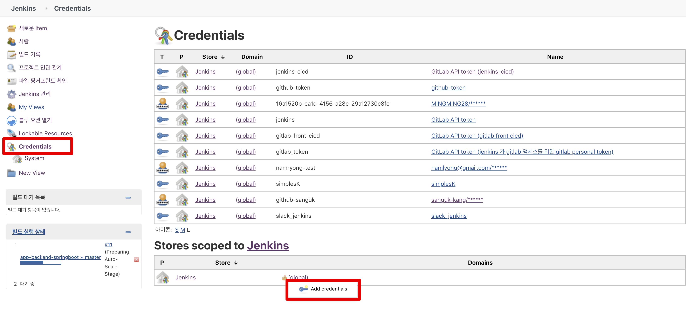
- 설정값
> Kind : Secret Key  
> secret : 슬랙에서 생성한 토큰값 입력  
> id : 화면에 보이는 id 값
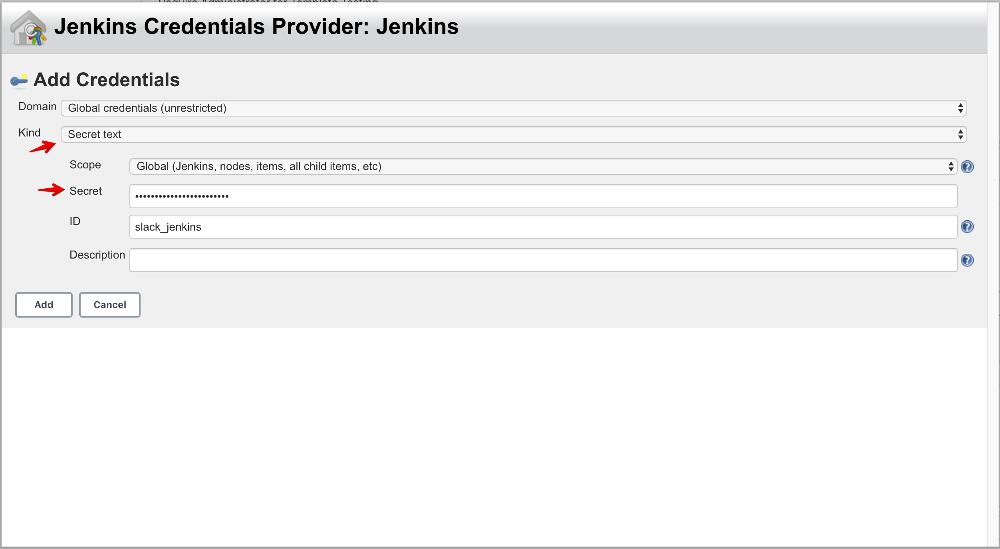

### 2-3) Jenkins 시스템 설정 등록
Jenkins 설정 등록을 하여 Jenkins 와 Slack을 연동한다.

- Jenkins 관리 > 시스템 설정
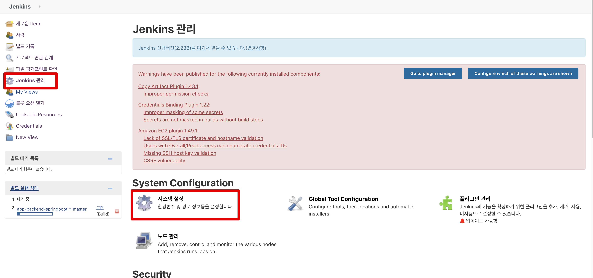

- Jenkins Slack 설정 및 테스트
> workspace : slack 결과에 나온 Team Subdomain 입력  
> Credential : 위에 생성한 Slack credential  
> member id :  slack channel id  
> Test Connection : 접속 테스트 버튼 -> 정상인 경우 좌측에 'Success' 출력
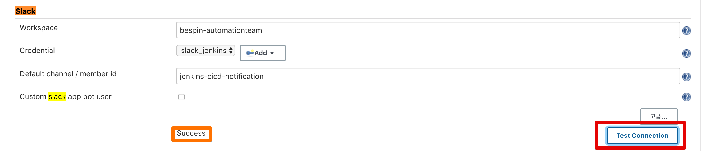

### 2-4) Jenkins project 설정
Jenkins project 에 따라서 Slack 연결을 별도로 연결하여 사용가능하다.

#### 2-4-1) 일반 설정
- Jenkins project > 구성 > Slack Notifications 선택
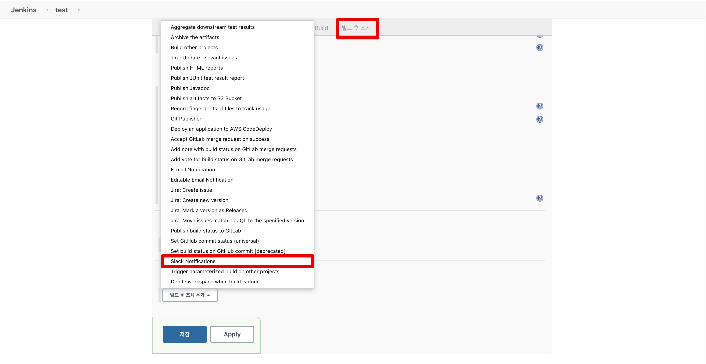
- Slack Notifications 필요한 내용 선택
>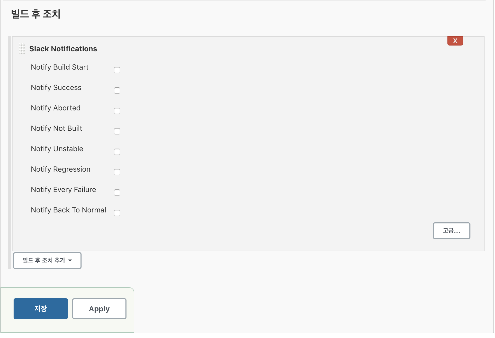

#### 2-4-2) pipeline or blue ocean 인 경우
> JenkinsFile 을 이용하여 작업한다.  

- 공통 함수 생성
~~~
def resultSlackSend(bar_color, result) {
  slackSend color: bar_color, message:"${env.JOB_NAME} - #${env.BUILD_NUMBER} : ${result} after ${currentBuild.durationString.split(" and")[0]} (<${env.BUILD_URL}|Open>)"
}
~~~
- 작업 시작 하는 경우
> pipeline step 안에서 호출
~~~
resultSlackSend("good", "START")
~~~
- 작업 종료한 경우
> pipeline steps 밖에서 호출
~~~
post {
    success {
        // 빌드의 결과가 성공일경우 
        resultSlackSend("good", "SUCCESS")
    }
    failure {
        // 빌드의 결과가 실패일경우 
        resultSlackSend("danger", "FAILURE")
    }
    aborted {
        // 빌드를 중간에 멈추는 경우
        resultSlackSend("warning", "ABORTED")
    }
}
~~~

- 결과
>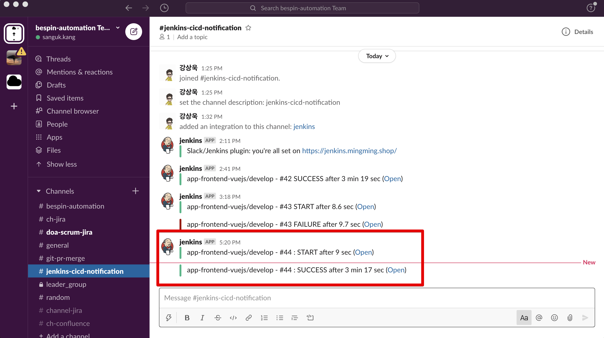

