# How to integrate Jira with Slack

## issue 발생 시 Slack Notification 처리 방법

### Jira 작업

* 설정->앱 을 선택한다.
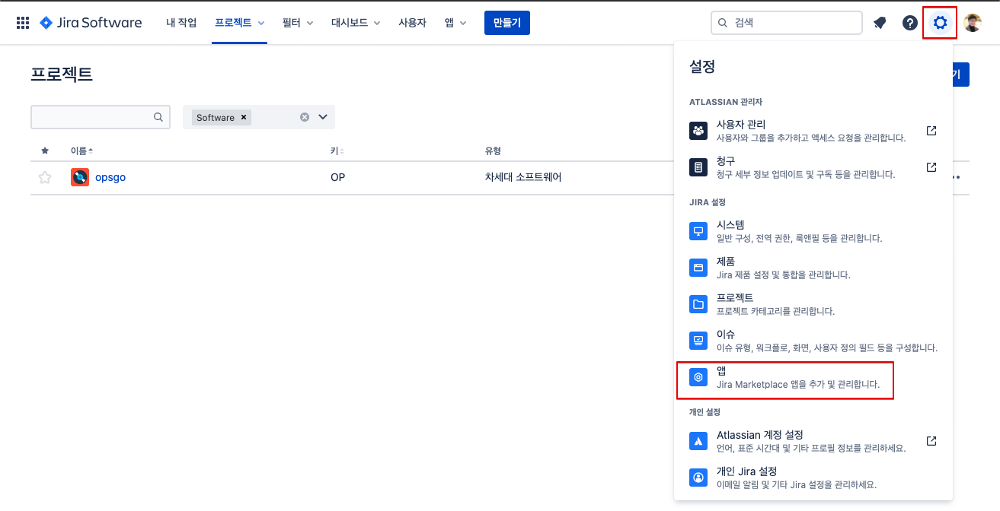

* slack 을 검색하고, 결과에서 Slack Jira Integration을 클릭한다.
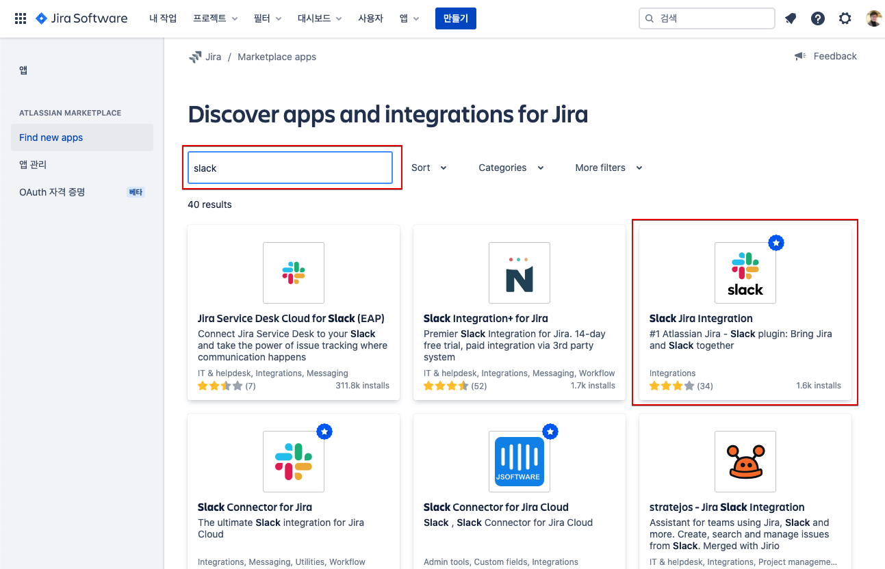

* Slack Jira Integration 설치 화면이 나타난다.

* 설치 를 클릭한다.
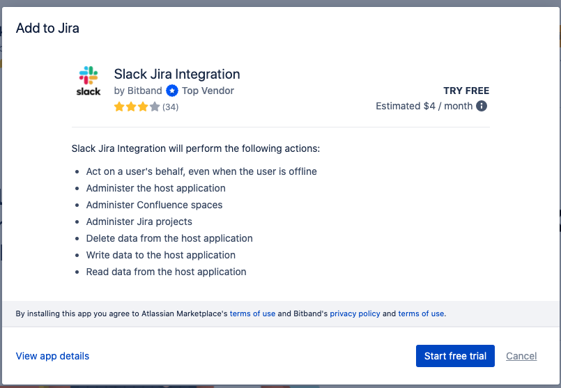

* 상단에 설치가 진행되고 있음을 팝업으로 보여준다.
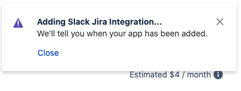

* 설치가 완료되었음을 팝업으로 보여준다.

* Slack Integration을 선택한다.
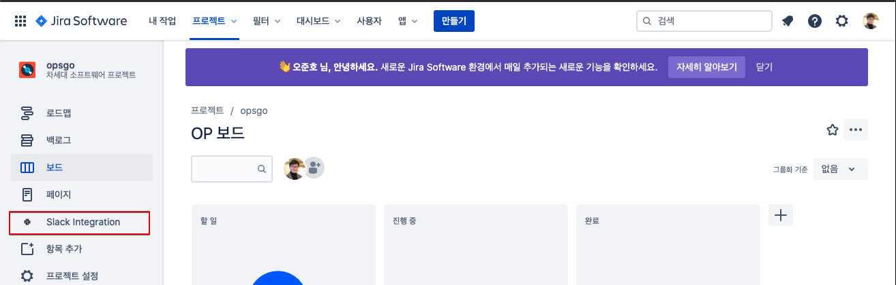

* Sign in with Slack을 클릭한다.
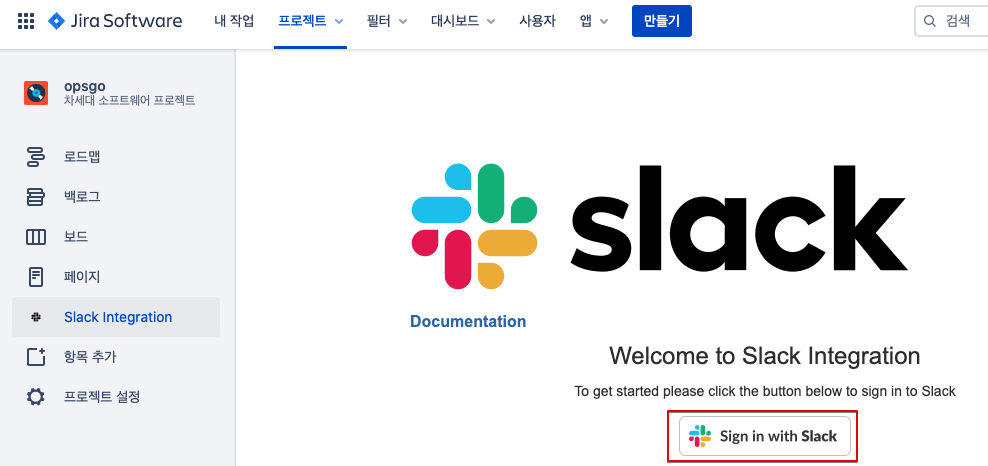

### Slack 작업
Jira로부터 알림을 받을 워크스페이스를 생성한다.

* 이메일 입력
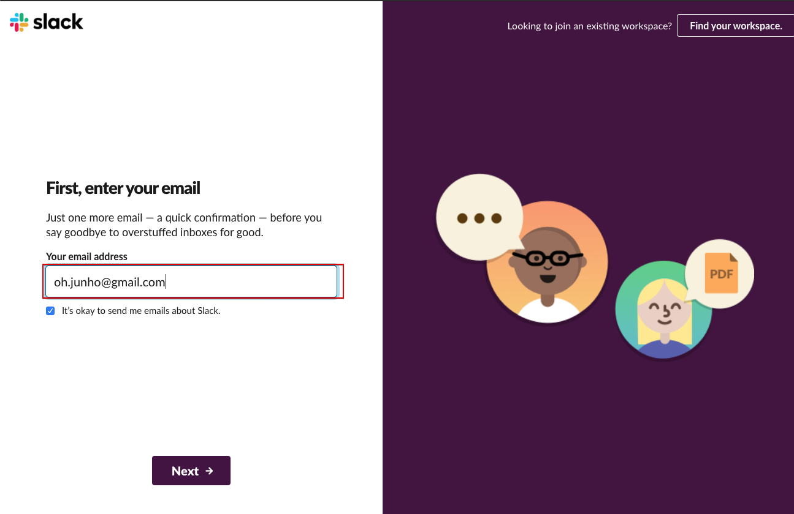

* 이메일로 전달된 Confirm 코드를 입력한다.
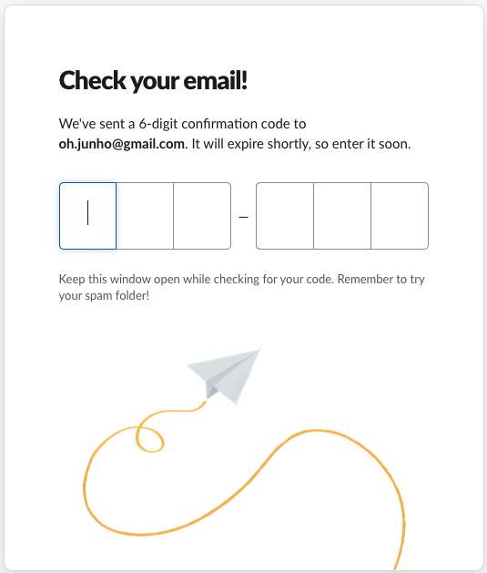

* 회사명 또는 팀 이름을 입력한다.
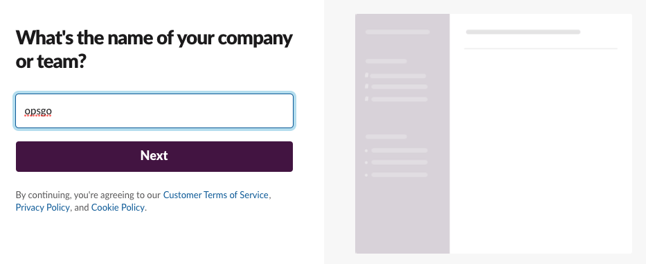

* Workspace 이름을 지정한다.
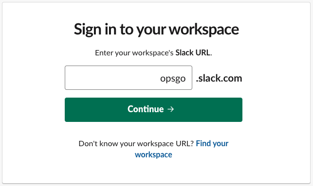

* 퍼미션 설정을 하고 Allow를 클릭한다.
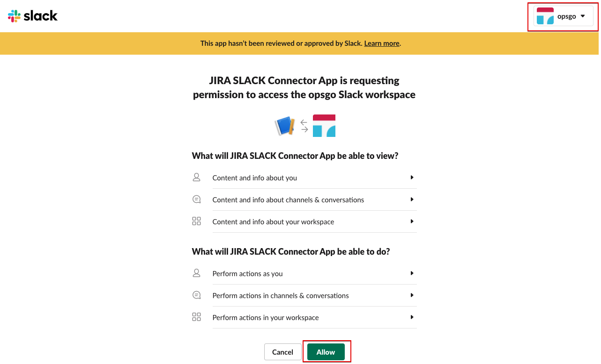

### Jira 작업
Slack으로 전달할 항목을 지정한다.

* Slack과 연결된 Workspace를 확인한다.
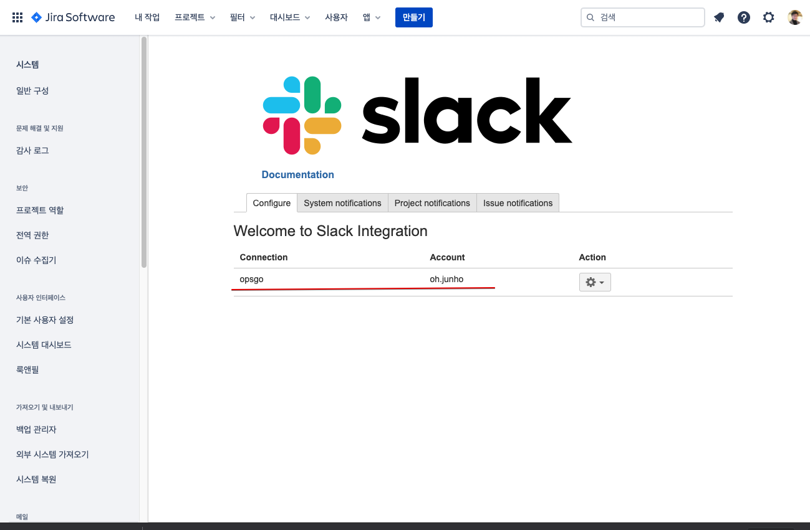

* Project notifications 탭을 선택하고 Create를 클릭한다.
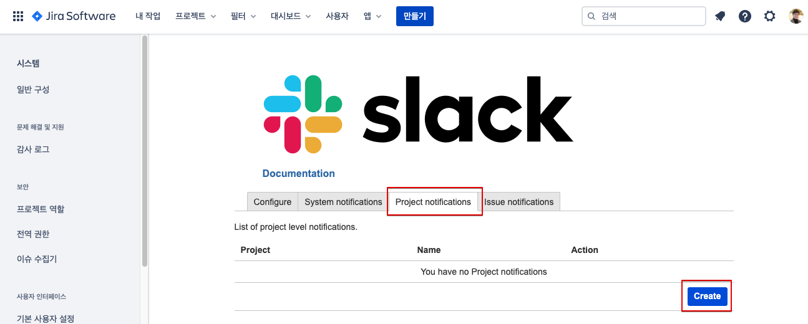

* Slack 채널을 선택하고 채널로 전달할 때 사용할 토픽을 지정한다.
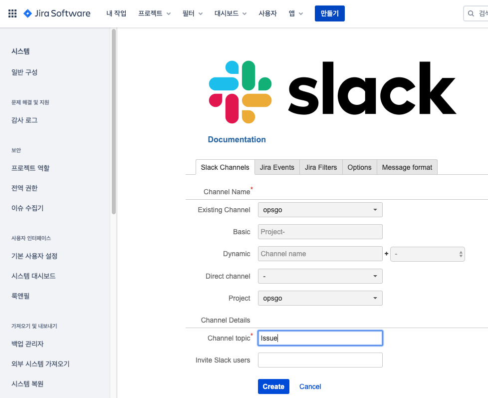

### Slack App
* Jira작업에 따라 Slack Workspace연결과 channel이 Issue라는 토픽으로 연결 되었음이 나타난다.

### Jira 작업
* Jira에서 이슈를 생성한다.
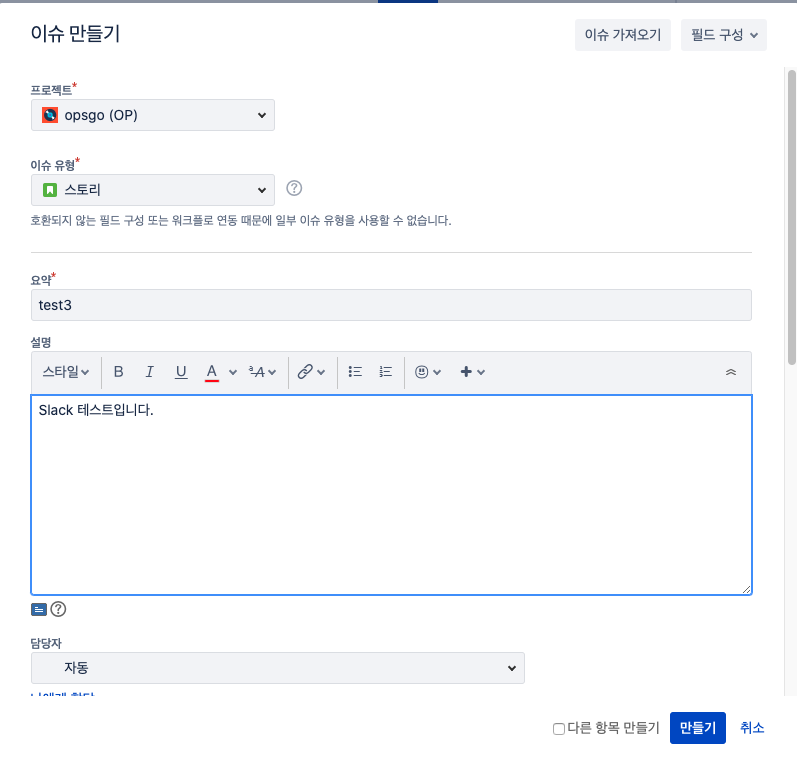

### Slack App
* opsgo 채널로 정상적인 notification이 전달됨을 확인할 수 있다.
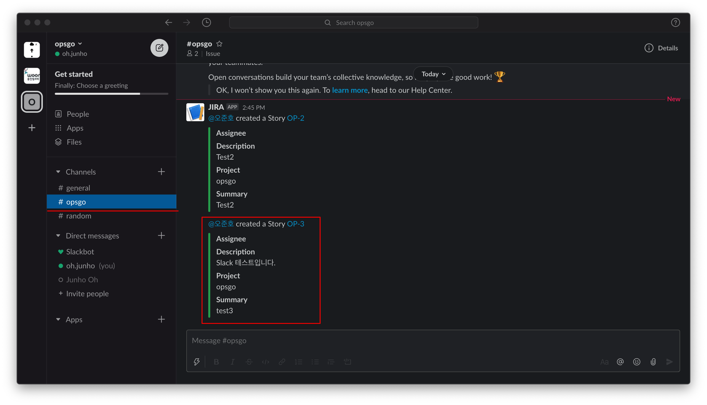
